# CelestialHang

It is time to see if you can guess the right answer before the person gets hanged? Do you have what it takes? The theme for this is celestial so anything space related, look up into the sky and find the words hidden amoung the stars. Just like the classic hangman game, you guess the worng letter and lose a life, until it is to late and you are game over. Guess the right letter and you might just have won the game!

It is a game for all ages, alone as a family or a group. A fun guessing game to use a bit of time. So why don't you go ahead and see if you can save the day or maybe you can find the hidden level hidden in your score.

## __User Stories__

- ### As a player

    - I want to be able to play the hangman game.
    - I want to be able to understand the game without much help, while also be able to read the rules for the game.
    - I will be told if I write invalid characters and then can redo my input.
    - I want to be able to choose a difficulty level based on skill level.
    - I want to be able to find the special level by earning enough point, and then keep playing it.
    - I want to be able to submit my own words for the game so that I can contribute to the game and make it more interesting for myself and others.
    - I want to be able to grade the game with stars and give review so that I can give feedback and help improve the game for future players.

## __Design__

### __Features__

### Existing Features

  - The game starts with telling the player welcome and showing the logo of the game. Then asked for who is playing. The player is wished good luck and send on their way.
  
  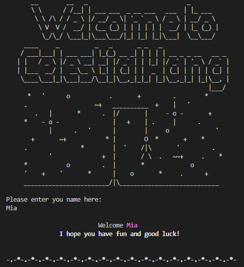

  - The rules is then showed so the player can read throught them.
  
  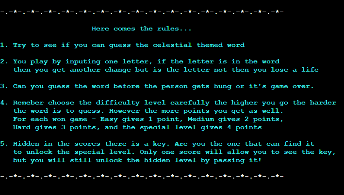

  - To begin with the player can choose a level of difficulty between easy, medium, hard and if they get enough points to unlock the hidden level, then they can also choose special. Each level have their own amount of lives and points for winning a round. Easy gives you 1 point and 5 lives. Medium 2 points and 7 lives. Hard 3 points and 10 lives. Special 4 points and 11 lives.

  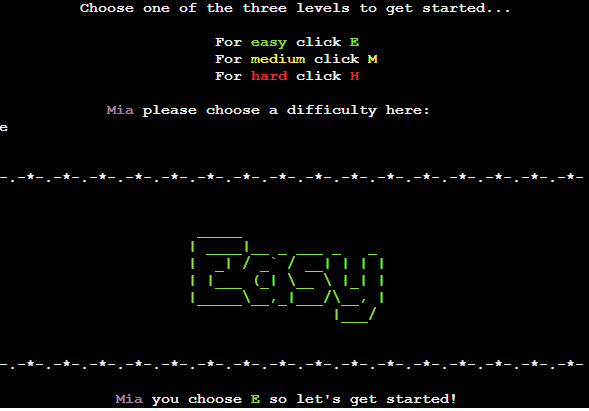
  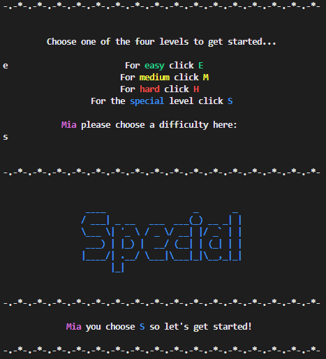

  - A random word from the choosen level is generated so the player can start to guess. The word is hidden only shown as a underscores symbolizing each letter. When the player guess a letter correct. The underscore disseapear and the letter is shown.
  
  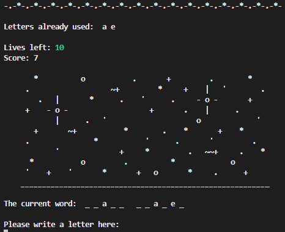

  - When the player have guess a letter 1 of 4 messages show up based on if the letter was in the word, the letter was not in the word, the letter already have been guessed on, and it wasn't a letter but a number or character.

  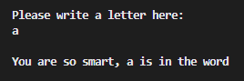
  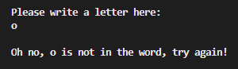
  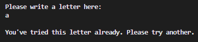
  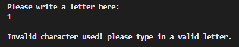

  - Game over will make one of many different endings shown e.g. lose, win, hidden key, and special amount of points. There is multiple for the special amount of points.

  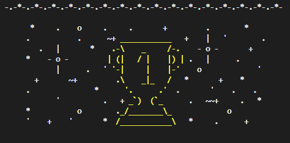
  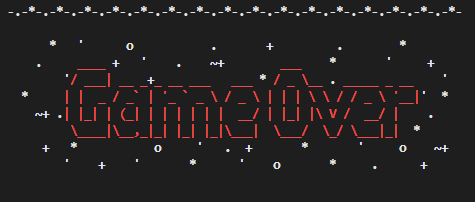
  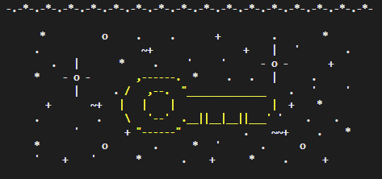
  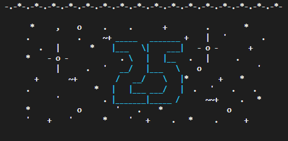

  - After the game has been won or lost the player is asked if they would like to play again. If the input was yes, the game restarts from the point where the player can choose what level they want to play.

  

  - If the answer is no then the player is send off to choose if they would like to send in 1-5 words for review that might end up in the game. 

  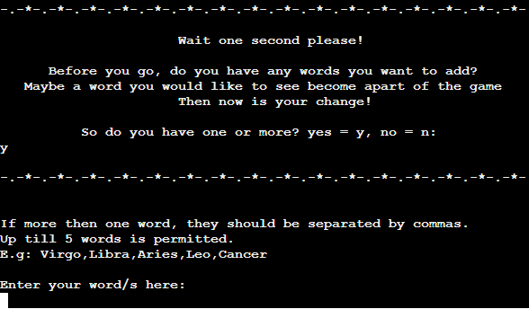

  - Either when they have send in some words or if they say no then they are send of to give the game a star grading. After giving it the aount of stars then the player can choose to send in a review of what they thought about the game.

  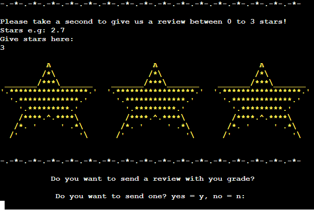

  - When the player have either said no or given some feedback they are send to the end of the game where they are thanked for having played, they can see the logo again and a disclaimer comes up at the end. 

  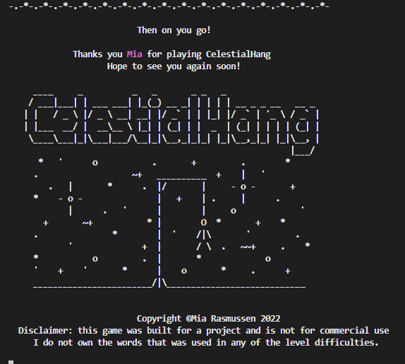

### Future Features

  - A fun future feature could be a leader board that show top 20.
  - Error messages with red background.
  - Point system that changes by each difficulty and how quick you can do it. So points would be based on how many lifes you had left in that round.
  - Multiplayer system. Where on one device multiplayer can be choosen and then 2 people can play against each other on guessing the most letters and losing the fewest lives. You could also play againt the computer.

### __Color__

  - Colors used in the game was a part of a library already in python program: colorama.

### __FlowChart__

- For visual aid to see what the game had to go through for it to work, I made this flowchart to go through each step for the basic ideas. The flowchart was created with [Lucid](https://lucid.app/documents#/dashboard).

## Technology

### Technologies Used

  - I have only used Python

### Programs Used
  - Git - Was used for version control, the Gitpod terminal to commit and push to GitHub.

  - [GitHub](https://github.com/) - Was used to store the project code

  - [Shields](https://shields.io/) - Was used to add different shields into the README. 

  - [Lucid](https://lucid.app/documents#/dashboard) -  Was used to create the flowchart.

  - [Heroku](https://www.heroku.com) - Was used to deploy the game.

  - [Ascii Art](https://ascii.mastervb.net/) - Was used for help on designing the ascii letters and numbers used.

## __Testing__

### Pep8 valitation in Gitpod workspace

  - The Pep8 website is not working at the moment. There for I added the Pep8 validator into my Gitpod workspace.
  - All errors have been fixed, it is showing some warnings because of the global keyword. However, this does not affect anything about the functionality. These can be changed by passing them as arguments at a later date.

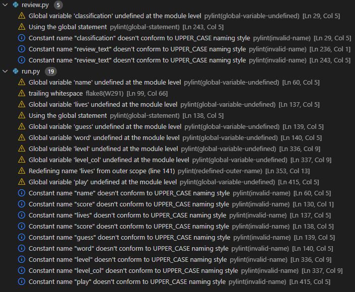

### Test cases

  - __As a visiting user, I want to be able to play the hangman game__
  - After a difficulty have been choosen the game begins. At the bottom you can take a guess on what letter there is in the word. Is the letter in it a letter show up where there where an underscore. Until there either is no more lives left or the word have been found and game won.

  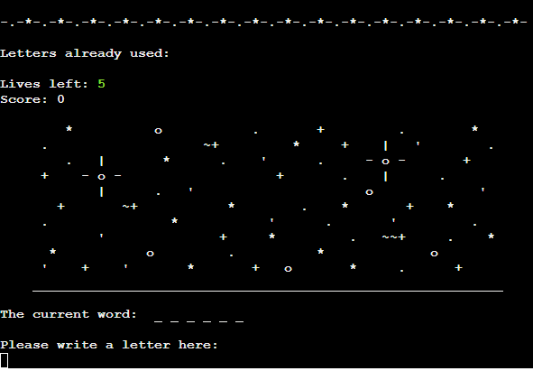

  - __As a visiting user, I want to be able to understand the game without much help, while also be able to read the rules for the game.__
  - The rules are one of the first thing a visitor gets to see. It is there for extra information, or if the visitor want's to check them over to be sure.

  
  
  - __As a visiting user, I will be told if I write invalid characters and then can redo my input.__
  - If at any input a visitor give either wrong data so invalid input or clicka wrong key, the game has multiple messages about that, and the visitor is asked to give the input again.
  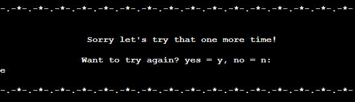

  - __As a visiting user, I want to be able to choose a difficulty level based on skill level.__
  - The visitor can choose whatever level they want, a level based on what they think they can handle.
  

  - __As a visiting user, I want to be able to find the special level by earning enough point, and then keep playing it.__
- When the visitor have played a certen amount of times and gotten the score the key will either show or just open up for the visitor to try to guess it's words and theme. Which is still space themede but something in space.

  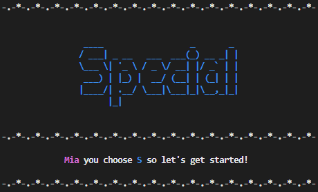

  - __As a visiting user, I want to be able to submit my own words for the game so that I can contribute to the game and make it more interesting for myself and others.__
  - The visitor can after decided not wanting to play anymore, decide if they want to add some words, there will be send for review.

  

  - __As a visiting user, I want to be able to grade the game with stars and give review so that I can give feedback and help improve the game for future players.__
  - Just like with the sending of words, the visitor gets to input a number for stars. And after the visitor can decide to leave feedback.

  

### Fixed bugs
  - One of my bugs where the fact that when choosing the difficulty level you would have it twice.
  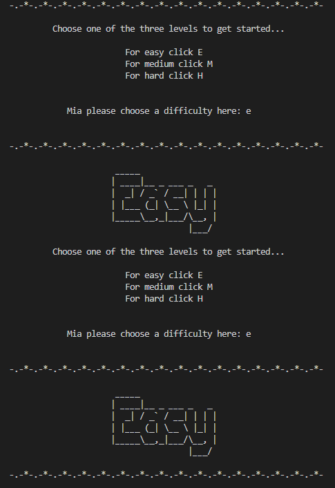
  This was fixed by fixing position of the game function to be above the level_difficulty fuction and not under it as well as deleting the main call on the level_difficulty fuction sinde the game. Because it was being called on the second time at the top of the game function.

  - My computer had problems after the deplyment to Heruko. All the underscores would disapear at random times and not come back. This was fixed not in the code but on my computer.
  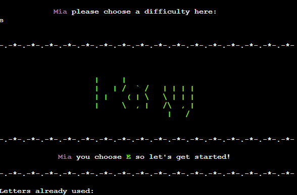
  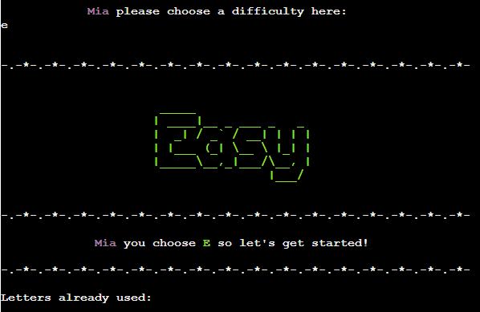

### Full testing
  - The game was tested in Chrome, Safari and Firefox browsers. It worked well on all browsers.
  - Tested for bugs and to make sure everything works.
  - Tested for all scenarios with valid guesses.
  - Tested for all scenarios with invalid guesses e.g numbers, characters spaces etc.
  - This has been tested by more then one person, to see if there where bugs.
  - Tested to make sure that input gets send to google spreadsheet.

## Improvements

  - The Easy level can sometimes be a lot harder then the Hard level. Lives amount might have to be switched around.

  - This game is not at all responsive, but can be played on all screens. It however, can be a bit hard to play on phones. This was however a backeend only created game so functionality was the main object for the game.

## __Deployment__

  - __via gitpod__
    - Log into GitHub.
    - Make a repository
    - Click the green button close to the top of the page that says Gitpod.
    - After letting Gitpod load an alert pops up on the top of the screen, click cancel.
    - Then click the button that says More Actions.
    - Hereafter click Open in Browser.
    - Now right click with your mouse over the big box on the left that has your repository name over it.
    - Click new file.
    - Then make an index.html file. 
    - Go to the top of the index file and click ! and enter. This will make a start template.
    - Make a basic structure for your index page.
    - Click on terminal at the bottom of the page.
    - write 'git add .'
    - Then for your first commit write 'git commit -m "Initial commit".
    - Hereafter write 'git push'.
    - Your code have now been pushed back and saved on your GitHub repository.

  - __Deployment to Heroku__
    - First log into your Heroku page on [Heroku website](https://www.heroku.com)
    - When on your dashboard click "new" and the click "create new app".
    - Now give you app a name make sure it is availble and then choose a region.
    - Click the "create app" button.
    - Go first to the "settings page".
    - If you are using a creds.js file then you will need to follow the next 4 steps.
      - Scrool down and find the button that says "reveal config vars" and click it.
      - Then write "CREDS" inside the box that says "KEY".
      - With you github open find the creds.js file and copy past the whole thing .into the box beside "KEY" that says "VALUE".
      - Now click the "add" button.
    - Scroll down bit more to find buildpacks.
    - Click on button that says "add buildpack".
    - Then click "python" and then click "save changes" button.
    - Repeat the last two steps but change the python buildpack out with nodejs.
    - Now cLick the "deploy page".
    - Click connct to Github in the deployment method.
    - Then you serch in your repository for the one you need. DO make sure the name is exactly the same.
    - Click the button "serch" and then click "connect"
    - Choose between automatic deployment or manual.
    - If manual was choosen wait for it to finish.
    - Now click the button "view"

## __Credits__

## Credits

### Code Used

### Content 

### Honourable mentions